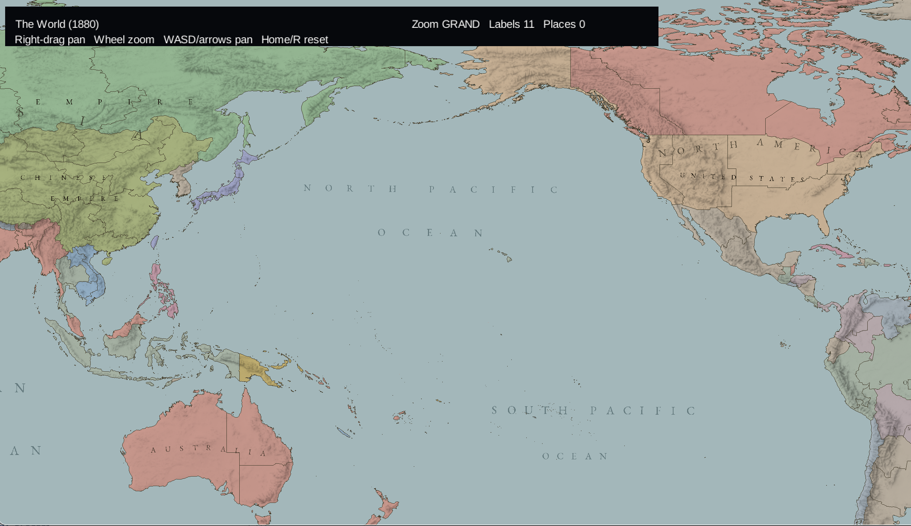

#  Messing with maps

A scrollable and zoomable Java map with a topographic relief layer and slightly shonkey glyphs.
The map is based on 1880 world borders. 

The historical border reference comes from [Historical Basemaps](https://github.com/aourednik/historical-basemaps); 
the vector geometry is prepared from public-domain [Natural Earth 5.1.1](https://www.naturalearthdata.com/) Admin-0 and Admin-1 data.

It uses Java 25, [libGDX](https://libgdx.com/) with the LWJGL3 desktop backend and FreeType, [JTS](https://locationtech.github.io/jts/) for offline geometry processing, Gradle, and JUnit 5.
